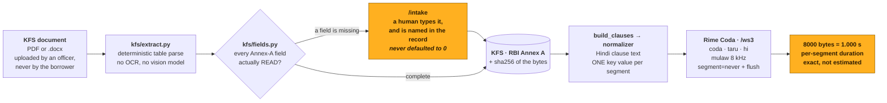
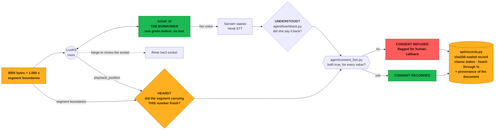

# SAMJHA (समझा) — voice-native informed consent for Indian retail lending

**Team harness** · DataForge × Pathway × Rime

> **Status: end to end.** KFS pipeline (PDF **and** Word), document intake, consent agent,
> eval harness and three web surfaces all built; **434 tests pass**. Measured results are
> in [`RIME_EVIDENCE.md`](RIME_EVIDENCE.md), against a test pre-registered in
> [`evals/ACCEPTANCE.md`](evals/ACCEPTANCE.md) *before any product code existed*. Not yet
> done: the human listening panel, the full 120-utterance eval run (see below), and a live
> PSTN leg (out of scope — the channel is simulated).
>
> A 3-minute walkthrough of the whole flow is at
> [`video/samjha_demo.mp4`](video/samjha_demo.mp4), the deck is
> [`ppt/samjha.pptx`](ppt/samjha.pptx), and the 9-minute talk it backs is scripted in
> [`PRESENTATION.md`](PRESENTATION.md) — with the operational runbook, including the
> borrower's own lines, in [`DEMO.md`](DEMO.md).

---

## Executive summary

RBI requires every retail loan to come with a Key Facts Statement in a language the
borrower understands, acknowledged as informed — but lenders satisfy it by emailing a PDF
and collecting an OTP, so a borrower with low reading fluency acknowledges a document she
cannot read. SAMJHA turns that document into a voice call: it parses the KFS
deterministically from its table grid (PDF or Word, no OCR and no model in the loop),
rewrites each clause into Hindi with **exactly one comprehension-critical value per
spoken segment**, and reads it to her through Rime Coda over an 8 kHz μ-law telephone
channel. Because μ-law at 8 kHz is one byte per sample, a segment's byte count *is* its
duration, so "did she hear the account number?" reduces to arithmetic over Rime's own
output — no vendor word timestamps, which Rime does not emit for Hindi anyway. A consent
state machine then requires each value to be both **heard** (its segment finished
playing) and **understood** (she explains it back in her own words) before consent can be
recorded; interrupt the account number and the clause is marked `PARTIALLY_HEARD`,
consent is **refused** even if she says yes, and the refusal is sealed into a sha256-hashed
record beside the hash of the source document. Measured against a claim pre-registered
before any product code existed, the delivery layer took Value Error Rate on account
identifiers from **100% → 0%** (Deepgram) and **75% → 0%** (Sarvam) — while four of six
categories showed no effect at all, which we report as the negative result it is.

## Architecture

One pipeline, drawn in two halves because it is twelve stages long. Half A turns a
document into speech; half B turns speech into a consent decision. **Only half B is
unusual** — half A is plumbing a competent team would build the same way.

### A · document → speech



### B · speech → consent record



**The load-bearing edges are the two that feed `HEARD?`.** That pair is the whole claim:
*heard* is not "we played the file", it is "the segment carrying **this number** reached
its last byte" — Rime's own byte counts on one side, LiveKit's measured playout on the
other. Nothing on that path is estimated, asserted, or supplied by a model. Everything
downstream of it — the refusal, the callback flag, the hash — is a consequence.

---

**Headline result.** Value Error Rate on account identifiers, 8 kHz μ-law channel,
model/speaker/lang held constant: **100% → 0%** (Deepgram), **75% → 0%** (Sarvam).
Four of six categories show *no* effect and are reported as the negative result they are —
Rime Coda handles Indian digit grouping, percentages and tenures correctly on its own.

⚠️ **Read that with its n.** The published run is **24 utterances, 4 per category**
(`evals/results/summary.md`, which labels itself `SMOKE run`), not the 120 utterances /
20 per category pre-registered in `evals/ACCEPTANCE.md` §3. The direction and the
mechanism are what the committed per-row evidence supports; the precise percentages rest
on n=4 and should be expected to move on a full run.

```bash
uv run python evals/run_eval.py --full     # the pre-registered 120
```

That costs roughly 40 minutes of Sarvam audio against ~66 minutes of free credit, and it
**overwrites** `evals/results/` — as does a bare `make eval`, which is a 6-utterance smoke
run. Every run is also archived under `evals/results/runs/<id>/`, so nothing is lost, but
check `git diff evals/results/` before committing after any eval.

**Remove speech and the product does not degrade — it ceases to exist.**

---

## Install

**Prerequisites.** [`uv`](https://docs.astral.sh/uv/getting-started/installation/) (it
installs the pinned Python 3.13 itself) and **ffmpeg** on `PATH` — the telephone channel
and the μ-law decoder cross-check both shell out to it.

```bash
brew install uv ffmpeg          # macOS; see the uv docs for Linux/Windows
```

```bash
uv sync                         # or: make setup
cp .env.example .env            # then add your keys — see "Keys" below
```

`uv sync` builds `.venv/` from `uv.lock`, which is ~685 MB and is why it is not shipped in
the archive. Nothing else needs fetching: the 10 synthetic KFS documents (PDF **and**
`.docx`), the pinned `livekit-client` bundle, and every committed eval artifact are all
already here.

### Verify it, no keys required

```bash
make test           # 434 tests
make demo-fixtures  # the two stress cases: barge-in and rushed consent
make channel        # self-check the telephone-channel chain (needs ffmpeg)
make secrets        # fail if a credential ever touched git history
```

### Verify it against the live vendors

```bash
make stage          # GO/NO-GO: keys, catalog, both processes, the tunnel, the fallbacks
make preflight      # (modelId, speaker, lang) against Rime's LIVE catalog
make eval           # the A/B, smoke run — see "Reproducing the numbers" below
make serve          # then open /?demo=1
```

### Keys

`RIME_API_KEY` is the only one needed to hear anything — Rime is free and self-serve, no
card. Everything else degrades rather than breaks:

| Key | Needed for | Without it |
|---|---|---|
| `RIME_API_KEY` | all spoken output | no audio anywhere; `--fake-audio` still runs the logic |
| `SARVAM_API_KEY` | the borrower's speech | `make talk` falls back to typing |
| `DEEPGRAM_API_KEY` | the second eval scorer | `--scorer sarvam` only |
| `LIVEKIT_*` | the browser call | `/intake` works; the token route 503s with a readable message |
| `OPENROUTER_API_KEY` | LLM teach-back grading | falls back to the offline grader |

### Taking a real call about a real document

```bash
make prompts        # the borrower page's spoken Hindi (needs RIME_API_KEY) — LISTEN to these

make serve          # terminal 1: the API and all three web surfaces
make agent          # terminal 2: the consent agent worker
cloudflared tunnel --url http://localhost:8000   # terminal 3: see the HTTPS note below

make stage URL=https://<tunnel>.trycloudflare.com   # then: is all of that actually up?
```

**Going fast, for a stage demo.** The identity clause opens with a greeting and an
instruction to the borrower — **12.6s on `demo/demo_kfs.pdf` before the account number
even starts**, out of a 20.9s clause. Neither segment carries an Annex-A field or a key
value. `SAMJHA_SKIP_INTRO=1` drops exactly those two, so the call opens on the account
number and reaches its first teach-back question in **about fifteen seconds** rather than
twenty-eight. Measured over a real Rime run (`make e2e --drive`): the identity clause goes
from 20.9s to 9.0–9.5s, and the whole ten-clause call from 159.3s to 145.7s.

It drops no Annex-A field and no key value; it does drop the borrower being told she may
interrupt, which is why it is opt-in, why `make stage` warns while it is on, and why the
agent writes a `note` into the call's event log naming it. `tests/test_kfs.py` asserts
that the two dropped segments are exactly the ones with no key value and that every key
value survives in both arms.

`make stage` is the pre-flight for a live call, and it is worth running before you rely on
one in front of anybody. It checks the cross-process failures no single health endpoint can
see — the worker in terminal 2 never started, the tunnel died, the Rime key is present but
revoked — and prints the one command that fixes each. It exits non-zero on anything
blocking, and names the fallback when it does.

`make fixtures` and `make vendor` regenerate the documents and re-fetch the browser bundle;
neither is needed on a fresh unzip, since both are already in the tree.

Then open **`/`**, drop a KFS on it, and it hands you a borrower link.
(`/intake` still resolves to the same page; the root took it over.)

### Or drive the whole flow from one command

```bash
make serve                                   # in another terminal

make e2e ARGS="--drive"                      # random fixture, spoken by Rime
make e2e ARGS="--doc ~/their_kfs.docx --drive --play"    # any document, out loud
make e2e ARGS="--drive --save /tmp/wav"      # keep the audio to listen to
make e2e ARGS="--sweep"                      # all 10 documents, both formats
```

`--drive` **synthesizes every clause through Rime Coda** and runs the real consent FSM
over the resulting byte-exact durations, then asserts the sealed record: that the barged
clause is `PARTIALLY_HEARD`, that its value is recorded as *not heard*, and that the
provenance cites the bytes you uploaded. Exit code 0 only if every assertion held, so it
works in CI. `--fake-audio` skips Rime for offline work and says so on screen — those
durations are estimates, not measurements.

## Three surfaces, three different people

| Page | Who | What it is |
|---|---|---|
| `/` | A field officer or branch clerk | **Intake.** Drop a KFS in, review every parsed field, correct what was not read, create the call |
| `/panel` | The judge | The evidence panel: live clause state, provider badge, consent record |
| `/c/{call_id}` | **The borrower** | Near-textless. One green button. Everything spoken in Hindi |

Uploading a PDF is itself a literacy-heavy act, so **the borrower does not do it** — the
lender's officer or a helper does, and the record names which (`uploaded_by_role`). Her
part of the flow begins at "take the call". The literacy problem is solved by the voice
channel, not by the upload screen.

Documents are read **deterministically from the table grid** — PDF via pdfplumber, `.docx`
via stdlib `zipfile` + `xml.etree`. No OCR, no vision model, no model in the loop. A
photograph or a scan therefore **cannot** be used; `kfs/extract.py`'s `read_tables()` is
the seam where such a reader would go.

Nothing is ever guessed. A required Annex-A field the document did not yield is reported,
not defaulted — because `cooling_off_period_days` defaulting to `0` makes the agent say
*"इस लोन में कूलिंग-ऑफ की अवधि नहीं है"*, denying a statutory right the document may well
grant. `kfs/fields.py` exists for that one reason.

⚠️ **The borrower page needs HTTPS.** `getUserMedia` requires a secure context, so on
plain `http://` from a phone the microphone is denied with no dialog and no error she
could read — the agent talks, teach-back never happens, and it looks like a broken
product. Serve it through a tunnel. The page checks and says so aloud.

⚠️ **`make agent` is not optional.** The worker registers with an `agent_name` and takes
explicit dispatches only, so that it never joins rooms belonging to other apps sharing the
same LiveKit credentials. Without it running, the borrower waits on a screen that never
changes.

⚠️ **There is no authentication.** A `call_id` is a bearer capability: anyone holding the
link can join that call and read its KFS. Fine for a demo, not shippable.

---

## The one hard claim

Coda exposes **no** phoneme control, **no** SSML, **no** pause tags and **no** lexicon —
and Hindi exists on no other Rime model. There is no fallback model with those knobs.
**The text layer is the only lever there is.** That is not a convenient framing; it is the
documented parameter surface.

The claim under test, and the acceptance criteria, are pre-registered in
[`evals/ACCEPTANCE.md`](evals/ACCEPTANCE.md), committed before any product code.

## Rime configuration

| Field | Value |
|---|---|
| `modelId` | `coda` — **pinned explicitly** |
| `speaker` | `taru` (Hindi, male). `nadi` is the only alternative. |
| `lang` | `hi` |
| `audioFormat` / `samplingRate` | `mulaw` / `8000` |
| `timeScaleFactor` | `1.0`, held constant. `speedAlpha` is never sent. |
| Transport | `wss://users-ws.rime.ai/ws3`, `segment=never` + explicit flush |

`modelId` **defaults to `mistv3`**, which has no Hindi at all, and Rime's docs state that
an unsupported pairing "can be accepted and synthesized" rather than erroring. So a single
typo would silently route the whole experiment to the wrong model while still returning
working audio. `make preflight` fetches the live catalog and hard-fails on a bad triple;
no speaker list is hardcoded anywhere.

## Two design decisions worth explaining

**We do not use Rime's word timestamps.** They are emitted only for English and Spanish —
a Hindi request receives `chunk` and `done` with no `timestamps` event *and no error*.
Instead the normaliser emits **at most one key value per flush segment**, and heard-through
is derived from LiveKit's real `playback_position` over known segment durations. mu-law at
8 kHz is 1 byte per sample, so byte count converts to duration exactly. This works in any
language and removes a vendor dependency from the central claim.

**We do not fence barge-in with `contextId`.** Rime has no cancel primitive — `clear` does
not cancel in-flight synthesis, and Rime "does not maintain multiple simultaneous context
IDs", so naive contextId-discard mis-attributes audio. A hard stop closes the socket, with
a warm spare connection kept open so reconnect latency never lands on the borrower.

## Limitations

Stated before the results exist, not after.

- The telephone channel is **simulated**. No live PSTN leg has been validated. The
  borrower needs a smartphone and a data connection, which is a real limitation of a
  product whose premise is that there is no screen.
- "Heard" means *played out of the speaker*, ± the client jitter buffer. We measure
  playout position, not cognition.
- Coda serves exactly two Hindi voices, so voice-level variance cannot be averaged over.
  Speaker is held constant — that is a limitation, not a control.
- **Hindi only, and it cannot currently be otherwise.** Coda is the only Rime model with
  Hindi at all. Other Indian languages need a different TTS vendor, not a config change.
- **Not a TTS benchmark.** We do not compare Rime to other providers. Both arms are Rime.
- **Document upload reads tables, not pictures.** No OCR and no vision model, so a
  photographed or scanned KFS is refused rather than guessed at.
- The synonym table in `kfs/fields.py` that absorbs a lender's own label spellings is a
  **hypothesis, not a measurement** — there is no real lender's KFS in this repo to test
  it against. Every synonym that fires is surfaced to the reviewer for that reason.
- No authentication anywhere. A call link is a bearer capability.
- All data is synthetic **by default, and by enforcement**: the server refuses a
  non-synthetic upload unless `SAMJHA_ALLOW_REAL_DATA` is set, and the consent record
  carries the uploader's declaration rather than an assumption. Set that flag and this
  bullet no longer describes your deployment.

## Layout

```
delivery/   normalizer/hindi.py · rime_ws3.py · config_guard.py
kfs/        schema.py (RBI Annex A) · build_clauses.py · finance.py
            extract.py   — PDF/.docx -> KFS; read_tables() is the per-format seam
            fields.py    — which labels must be READ rather than defaulted
agent/      consent_fsm.py · teachback.py · rushed_consent.py · session.py · main.py
evals/      ACCEPTANCE.md (pre-registered) · run_eval.py · asr_score.py · channel.py
            corpus/ (120 typed utterances) · results/ · human_panel/
api/        main.py · store.py · records.py (hashed consent record)
            intake.py    — uploaded bytes -> a reviewable draft, with provenance
web/        intake.html  — THE ROOT (/): drop a KFS, review every field, create the call
            index.html   — /panel and /record/{id}: clause state, provider badge, ?demo=1
            call.html    — THE BORROWER'S PAGE: one green button, spoken Hindi
            prompts.py   — pre-renders that Hindi through Rime
            vendor/      — pinned livekit-client, fetched by `make vendor`
fixtures/   synthetic/ — 10 KFS documents as JSON, PDF and .docx. All synthetic.
scripts/    battery.py (day-1 experiments) · smoke.py (credential checks)
            talk.py (be the borrower, from a terminal)
            stagecheck.py — GO/NO-GO before a live demo (`make stage`)
            answers.py   — the BORROWER's lines for a document (`make answers`),
                           each one pre-checked against the teach-back grader
```

---

## Team harness

Built for the DataForge × Pathway × Rime finals.

- **Swapnanil Adhikary** — <swapnanil@tell-ia.com>

Every commit in this repository is signed by its author; `git log --format='%an %ae'`
is the record. The claim under test was pre-registered in
[`evals/ACCEPTANCE.md`](evals/ACCEPTANCE.md) before any product code existed, and the
commit timestamp on that file is the evidence for it.
